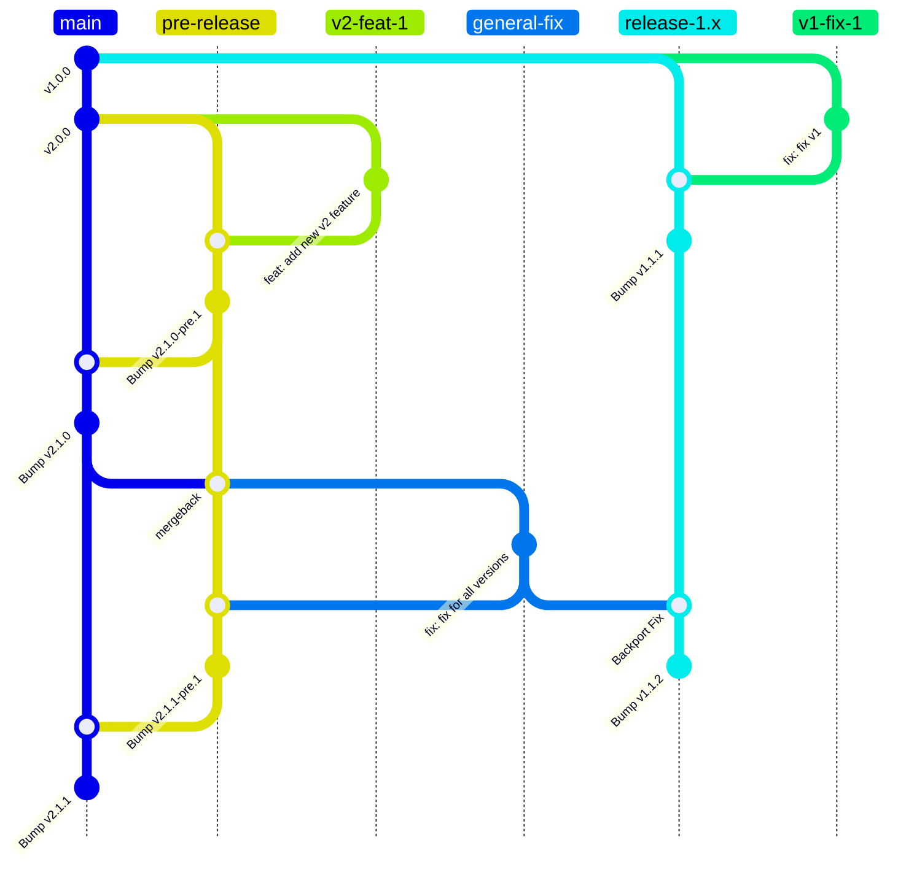
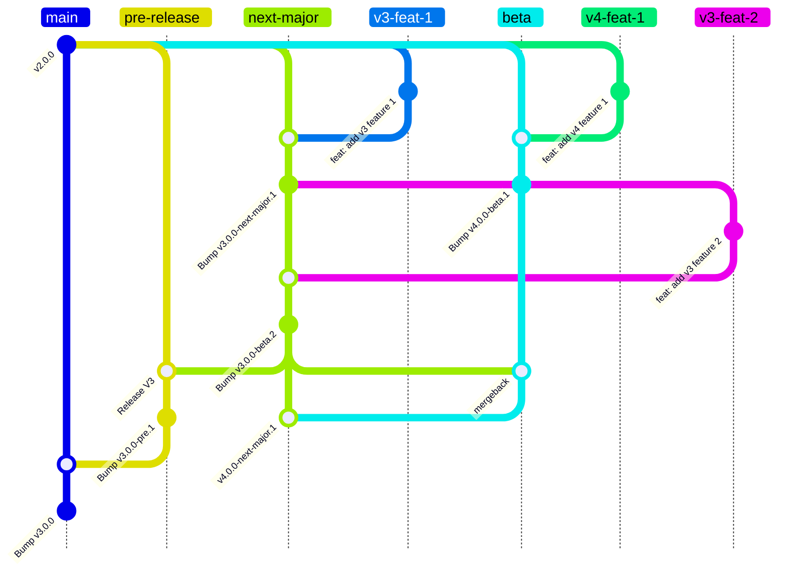

# Branching Strategy and Versioning Workflow for Smile CDR Helm Charts

This document outlines the versioning strategy and branching workflow for the Smile CDR Helm Charts.

The workflow is based on the semantic-release [workflow](https://semantic-release.gitbook.io/semantic-release/recipes/release-workflow) but has been modified to work in conjunction with the Smile CDR release process.

This branching workflow aligns with Semantic Release guidelines and integrates with the CI pipeline for automated versioning and release management.

## Versioning
As these Helm Charts follow SemVer 2.0, the version format is ``MAJOR.MINOR.PATCH`` with an optional suffix for pre release (``-pre.n``) or beta (``-beta.n``) versions

Refer to the [Versioning Strategy](../upgrading/versioning-strategy.md) page for more information.

## Branch and Flow Overview

The following branches are used to auto-publish releases to the `stable` release channel:

| Branch | Release Format | Usage |
| - | - | - |
| `main` | `MAJOR.MINOR.PATCH` | The current stable production-ready release |
| `release-n.x` | `MAJOR.MINOR.PATCH` | Used for maintaining stable updates for previous `n.x` production releases. Only created after the release of the 'n+1' version |

The following branches are used to auto-publish future versions to the various release channels:

| Branch | Release Format | Release Channel | Usage |
| - | - | - | - |
| `pre-release` | `MAJOR.MINOR.PATCH-pre.n` | `pre-release` | Used for developing non-breaking changes on the current release, `n` |
| `next-major` | `MAJOR.MINOR.PATCH-next-major.n` | `next-major` | Used for ongoing development of the next upcoming major release, `n+1` |
| `beta` | `MAJOR.MINOR.PATCH-beta.n` | `beta` | Used for developing and previewing the future release, `n+2` |
| `alpha` | `MAJOR.MINOR.PATCH-alpha.n` | `alpha` | Used for developing and previewing the future release, `n+3` |

New features get developed in their own feature branches and get merged into one of the branches above to trigger the respective release process.

### Branch Flow for Release and Maintenance Branches
The bulk of Helm Chart features and fixes are developed for the current stable release of the Helm Chart.

* Development is performed on a feature branch which is then merged into the `pre-release` branch
    * This merge will automatically create the next minor/patch pre release in the `next-major` channel.
* To publish an official release, `pre-release` is merged into `main`
    * This merge will automatically create the next official minor/patch release in the `stable` channel.
* Fixes (and optionally, features) can be back ported to previous releases using the `release-n.x` maintenance branches

The below Git workflow demonstrates this process, assuming that we start out with version `1.0.0` being the current stable release.

### Branch Flow for Future Versions
Some Helm Chart features and fixes contain breaking changes need to be developed for a future major release of the Helm Chart. This can occur when:

* The chart is updated to use the next major Smile CDR release
* The feature or fix contains a breaking change that cannot be implemented in a backwards compatible fashion

The development process is the same as the regular [branch flow above](#branch-flow-for-release-and-maintenance-branches), except different branches are used:

* Development is performed on a feature branch which is then merged into the `next-major`, `beta` or `alpha` branch.
    * This merge will automatically create the next major beta release in the appropriate release channel.
* To initiate an official major release, the repo maintainer creates a merge request from `next-major` into `pre-release`
    * This merge will automatically create the next major pre release in the `pre-release` channel.
* To complete an official major release, the repo maintainer creates a merge request from `pre-release` into `main`
    * This merge will automatically create the next official major release in the `stable` channel.

The below Git workflow demonstrates this process, assuming that we start out with version `2.0.0` being the current stable release.

## Developing New Helm Chart Features
When developing new features or functionality for the Helm Chart, the chosen branching strategy depends on the following:

* Does the feature depend on a specific version of Smile CDR?
* Does the feature include breaking changes?
* Is there any urgency to officially release the feature before the next major Smile CDR release?
* Does the feature need to be back-ported to previous Helm Chart releases?

### Features Without Smile CDR Version Dependency
When developing a feature that does not depend on a specific future version of Smile CDR, the branching strategy will depend on whether the feature introduces a breaking change or not.

#### Without Breaking Changes
If the feature does **NOT** depend on a specific version of Smile CDR, and does **NOT** contain breaking changes, then it can be safely developed on the `pre-release` branch with the intent of inclusion as a minor version bump of the current stable major release.

#### With Breaking Changes
If the feature includes breaking changes, then it should be developed on the `next-major` branch with the intent of inclusion in the next major release, along with the next release of Smile CDR.

!!! note "Note on Urgent Features"
    In cases where there is urgency to have the new feature released ***before*** the next Smile CDR release cycle, we **SHOULD NOT** release a new major version of the Helm Chart, as it will throw off the predictable version mapping between Smile CDR Quarterly releases and Helm Chart major version releases.

    In such situations where the new functionality is critical for an environment, it may be preferable to use the next upcoming version of the Helm Chart before it is released. There are caveats with this approach, so it needs to be addressed on a case-by-case basis.

### Features With Smile CDR Version Dependency
If the feature or functionality depends on a specific future version of Smile CDR, then it should be developed on the appropriate `next-major`, `beta` or `alpha` branch.

!!! note
    When starting work on a new major version on one of these branches, it's critical that the source branch has already had a release for `n-1`. This is to ensure that the semantic release processes chooses the correct version for the pre releases.

    For example: If starting work on v3.0 on the  `next-major` branch, the source branch should already have a version `2.x.x` in order to ensure the resulting pre release will be version `3.x.x-next-major.1`.

    <!-- See the [Post Release Tasks]() section for more info on updating `next-major`, `beta` and `alpha` branches. -->

### Examples

The following examples assume that the current Helm Chart stable version is `2.0.0`, using Smile CDR `2024.08.R01`

=== "Without Smile CDR Version Dependency"

    === "Without Breaking Changes"

        If you are developing a new feature **WITHOUT** breaking changes.

        * The `pre-release` branch should be used to develop the feature.
        * This will result in pre release builds (e.g. `2.1.0-pre.1`) being released in the `pre-release` channel to facilitate testing.
        * When you merge this change to `main`, version `2.1.0` will be released in the `stable` channel for general consumption.

    === "With Breaking Changes"

        If you are developing a new feature **WITH** breaking changes.

        * The `next-major` branch should be used to develop the feature.
        * This will result in pre release builds (e.g. `3.0.0-next-major.1`) being released in the `next-major` channel to facilitate testing.
        * This feature will ultimately result in the release of version `3.0.0` when it is promoted to the `stable` channel for general consumption.

=== "With Smile CDR Version Dependency"

    If the new feature depends on a specific future Smile CDR version, then this is implicitly a breaking change. Therefore there is no option to use the `pre-release` branch, which is only to be used for non-breaking changes.

    If you are developing a feature that depends on Smile CDR `2024.11.x`

    * The `next-major` branch should be used to develop the feature.
    * This will result in pre release builds (e.g. `3.0.0-next-major.1`) being released in the `next-major` channel to facilitate testing.
    * This feature will ultimately result in the release of version `3.0.0` when it is promoted to the `stable` channel for general consumption.

## Developing Helm Chart Fixes
When developing hot-fixes or patch updates for the Helm Chart, the chosen branching strategy depends on the following:

* Is this an upstream patch level change? (i.e. Changing the default Smile CDR version from `2024.05.R03` to `2024.05.R04`)
* Is this a Helm Chart fix/patch (i.e. a bug in the functioning of the Helm Chart)
* Does this fix affect all currently supported major versions of the Helm Chart?

### Helm Chart Fix/Patch
If your update is a fix for some broken Helm Chart functionality, and if it is **NOT** a breaking change, changes get merged to the `pre-release` branch if they are to be previewed on the 'pre-release` channel prior to official release.
When ready to release the change, changes are merged to the `main` branch to release to the `stable` channel.

!!! note "Fixing Multiple Helm Chart Versions"

    If the fix is required on multiple versions of the Helm Chart, then the process will need to be repeated for the `release-n.x` maintenance branches for each of the currently supported releases.

### Upstream Smile CDR Patches
If you are simply updating the current Smile CDR release to the latest patch version, merge your changes to the `pre-release` branch if you want to preview the fix/patch on the `pre-release` channel.
When ready to release the change, changes are merged to the `main` branch to release to the `stable` channel.

This process should only be performed on Helm Chart versions who's Smile CDR version has received a patch level update.

For example, if Smile CDR `2024.05.R04` gets updated to `2024.05.R05`, but `2024.08.R01` does not get updated, then changes would only be made to the version `release-1.x` release branch and not the `release-2.x` branch. When `2024.08.R01` gets updated to `2024.08.R02`, that change would only apply to the `release-2.x` branch.

### Merging Feature Branches
All updates should be developed on a feature branch. The feature branch should be created from the branch that you intent to contribute to.

All merges back to the appropriate release or pre release branch should be done using a Merge Request in GitLab. Release branches are protected and **SHOULD NOT** have commits pushed directly to them.

When creating feature branch merge requests, they should only be for a single feature. **DO NOT** include arbitrary changes in your feature branch, such as unrelated typos or formatting areas in different areas of code. These should be done in a separate branch/merge request.

Commits **MUST** be squashed for feature branch Merge Requests. The commit **MUST** follow the appropriate *conventional commits* message.
